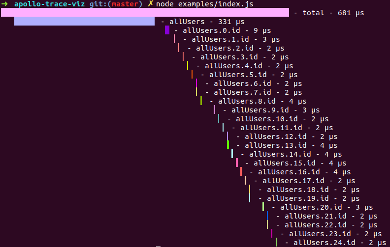

# Usage

```
yarn add apollo-trace-viz
```

Ensure your graphql server is returning valid [apollo-trace](https://github.com/apollographql/apollo-tracing) extensions. Then pass the response to apollo-trace-viz.

And it'll print a visualization of your response. After drawing the visuals to the console it returns the response so you can chain it with other promise handlers.



## Example

```javascript
const viz = require('apollo-trace-viz')
const { GraphQLClient } = require('graphql-request')

const client = new GraphQLClient('https://fakerql.com/graphql', {
  headers: {
    'x-apollo-tracing': 1,
  },
})

client
  .rawRequest(
    `{
      allUsers {
        id
      }
      }`,
  )
  .then(viz)
  .catch(console.error)
```
